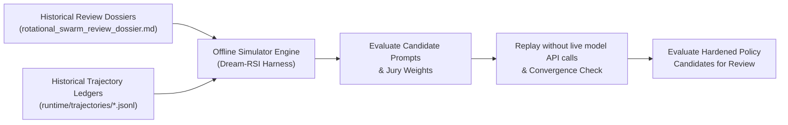
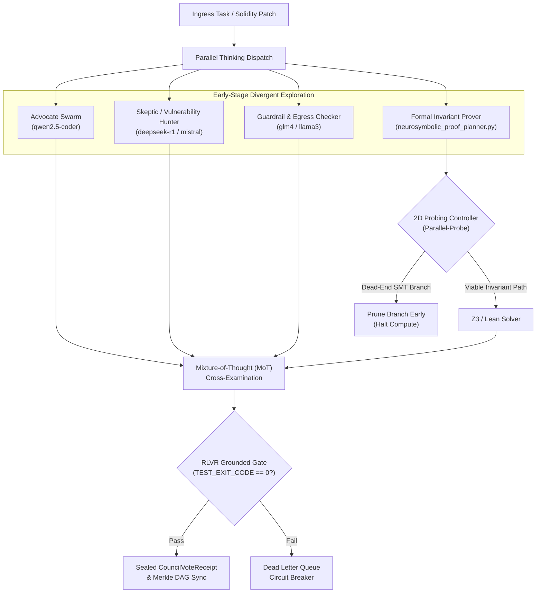

# Dream-RSI & Parallel Thinking Architectural Specification

**Status:** Canonical Reference Architecture  
**Primary Subsystems:** `CouncilEngine` (RLVR, Jury, Proof Planner) & `Dizzy-the-Polymath` (Trajectory Distillery, Memory Metabolism)  
**Theoretical Lineage:** Tong Zheng et al. (*Dream-RSI: Recursive Self-Improvement through Evolving Worlds*, *Parallel-R1*, *Parallel-Probe*) & RLVR (*Reinforcement Learning from Verifiable Rewards*)

---

## 1. Architectural Motivation: Escaping the API Credit / 429 Bottleneck

Autonomous multi-agent consensus networks (heterogeneous swarms involving Qwen, Mistral, GLM4, DeepSeek, and frontier arbiters) face two critical failure modes when operating online:
1. **FinOps / Rate-Limit Exhaustion:** Dispatching full live swarms for every minor prompt tweak or threshold calibration rapidly burns token budgets and triggers 429 rate-limit cascades.
2. **Sequential Reasoning Latency:** Traditional single-chain reasoning struggles with complex formal proofs and multi-angle security audits, either stalling or hallucinating verification.

To resolve these challenges, CouncilEngine and Dizzy adopt two complementary paradigms:
- **Dream-RSI (Offline Simulation Replay):** Evaluating policies offline against historical traces.
- **Parallel Thinking & 2D Probing:** Exploring divergent hypotheses concurrently and pruning dead-end branches before compute is wasted.

---

## 2. Dream-RSI: Offline Trajectory Replay Simulator

### Core Principle
Rather than evaluating new prompts, jury weightings, or pattern candidates against live external LLM APIs, historical execution traces are treated as an **offline replay simulator**.



### Subsystem Mappings
1. **Dizzy-the-Polymath (`lib/trajectories.mjs`, `lib/memory_metabolism.mjs`):**
   - Historical known-good trajectories (`runtime/trajectories/known_good.jsonl`) act as test fixtures.
   - During memory metabolism, candidate heuristics and distilled pattern proposals are evaluated against past friction logs and trajectories before promotion.
   - *Design Goal:* Replay against local artifacts without requiring live external model API calls.

2. **CouncilEngine (`rlvr_ruler_reward_engine.py`, `rlvr_dataset_exporter.py`):**
   - Historical review dossiers (`reviews/*dossier*.md`) and past convocations serve as the replay environment.
   - Candidate `DeclarativeQualificationMatrix` parameters and jury prompt harnesses are validated offline against historical findings to verify that verdicts remain deterministic and fail-closed.

---

## 3. Parallel Thinking & 2D Probing in CouncilEngine

CouncilEngine does not rely on flat sequential voting. It structures consensus as an adversarial, multi-perspective parallel reasoning tree.



### Mechanisms
1. **Early-Stage Divergent Exploration:**
   - Council dispatches orthogonal reviewer personas (Advocate, Skeptic, Guardrail, Formal Prover) concurrently.
   - Each persona evaluates the proposal from non-overlapping dialectical coordinates (Elegance vs. Durability, Autonomy vs. Supervision).

2. **2D Probing & Branch Pruning (`neurosymbolic_proof_planner.py`):**
   - During formal theorem proving and SMT constraint solving, the engine probes branch depth and confidence.
   - Unviable proof branches are aborted early rather than waiting for solver timeouts, conserving CPU and model context.

3. **Late-Stage Mixture-of-Thought (MoT) Synthesis:**
   - The parallel branches do not simply cast blind votes. Divergent findings are cross-examined in a synthesis pass.
   - The Skeptic’s potential vulnerabilities are directly tested against the Formal Prover’s invariant guarantees.

---

## 4. Grounding Consensus in Verifiable Rewards (RLVR)

Consensus is never purely subjective or rhetorical. CouncilEngine grounds all outputs in deterministic verifiers via `rlvr_ruler_reward_engine.py`:

```python
VerifierKind = Literal[
    "TEST_EXIT_CODE",     # Deterministic Hardhat / pytest exit code
    "AST_PARSE",          # Abstract Syntax Tree structural validation
    "FORMAL_PROOF",       # Z3/SMT or Lean mathematical proof
    "RECEIPT_VALIDATION", # Cryptographic receipt hash & signature verification
    "CUSTOM_CHECK"        # Invariant shield assertion
]
```

- **Zero-Tolerance Gate:** If an LLM jury votes "APPROVED" but the accompanying test suite fails (`TEST_EXIT_CODE != 0`), the scalar reward drops to `0.0` immediately.
- **Dataset Export:** Trajectories that pass all verifiable reward signals with `scalar_reward >= 0.8` are exported by `rlvr_dataset_exporter.py` into JSONL candidate datasets for evaluation or local offline model fine-tuning (GRPO/RLVR), providing structured training artifacts without claiming autonomous recursive self-improvement.

---

## 5. Summary Operational Directives
1. **Always dream before spending:** Replay new prompts and matrices against historical dossiers before launching live swarm reviews.
2. **Prune early:** Apply 2D probing to proof trees in `neurosymbolic_proof_planner.py`.
3. **Ground in deterministic verifiers:** Never promote or authorize an apply receipt without a passing `VerifierKind` signal.
